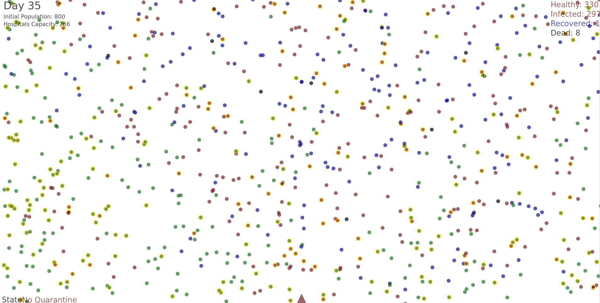

# Coronavirus-Simulation
This simulation mimics the movement and behaviour of a human society.  
It also allows the user to control the collective behaviour of the population (Quarantine / No quarantine).  
These two factors combined allow the simulation to showcase how COVID-19 can spread within a given population depending on the collective behaviour of the society.  
A chart is displayed every two weeks (simulation time) in order to show the impact of the collective actions, as well as the infection rate, death rate and hospital capacity.

## 1. Creating simulation world:
- [x] Creating a population:
    1. Creating n individuals
    2. Individuals have:
        - [x] Immunity
        - [x] A state: Healthy - Infected - Hospitalized - Recovered - Dead
    3. Individuals can:
        - [x] Move and interact with others
        - [x] Be in quarantine
- [x] Handling interactions within the population:
    - [x] Infected individuals can infect healthy individuals.
    - [x] Infected individuals with low immunity get hospitalized.
    - [x] Hospitalized individuals can die.
    - [x] Infected individuals with good immunity can recover
    - [x] Individuals in quarantine do not get infected
    - [x] User can (un)trigger a global state of quarantine.
- [x] Keep track of the numbers:
    - [x] Introduce a time concept
    - [x] Keep track of healthy, infected, hospitalized, recovered and dead individuals over time.
    - [x] Display charts every 14 days with historical data.

